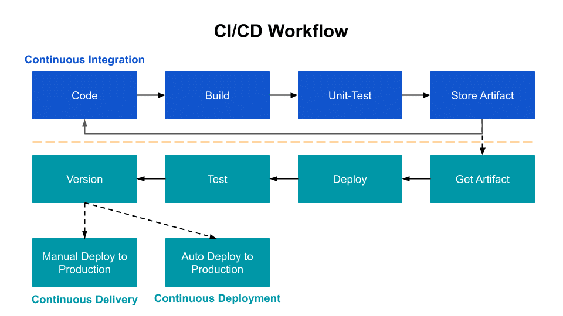

# Simple CI/CD Project

## Overview of purpose
TDZ Inc., social media production team used share point to share and update many of their web design and programming projects. Issue:  works were uncontrollable and waiting time was wasted. DevOps, a better way to increases an organization's ability to deliver applications and services at high velocity. A simple CICD created high level to share with them.

 

## GihHub Actions to build a CI/CD 
(Continuous integration and either continuous delivery or continuous deployment. Team Collaboration by enforcing automation in building, testing and deployment of applications withing GitHub)

## Steps of basic myGithubActions CICD
1. Signing up for a new GitHub account (https://docs.github.com/en/get-started/signing-up-for-github/signing-up-for-a-new-github-account)
2. Creating a new repository and add a ReadmeFile (https://docs.github.com/en/github/creating-cloning-and-archiving-repositories/creating-a-repository-on-github/creating-a-new-repository)
3. Create the workflow using superlinter.yml & input the code name: Super-Linter
4. Create a workflow (https://docs.github.com/en/actions/quickstart)
* Add file and create new file example: mygithubactions/.github/workflows/superlinter.yml
* Input the code (Push event on ubuntu latest container, check the code and run the Super-Linter
* Commits to main branch & click the Code tap, back to main repository
* On static side icon show Yellow as running the workflow & checking the code. If all check code pass, it will turn Green. If all check code fail, it will turn Red. 
* Check on static side icon or Actions tap to review the Super-Linter workflow. 
* Super-Linter workflow. Able to review the setup job, Pull the code & check code and run the Super-Linter again
* Back to main Code area, it will show static side icon status (pass or fail). First setup, it passed & shown the green checkmark.
5. Push some code to generate error, workflow name: main.py
6. Same step as item 4 above. Static side icon status shown red icon
7. Correct the code, back to code, correct main.py code and run the main.py again & commit changes. If code no issue, static side icon will show green check 
8. Any error, Github will notify via email 
9. Tap on Actions, you will able to review all Events, status & Branch on all your actions of the above
10. Many errors shown on the code and no major issue, the webpage still able auto update, link to the correct URL, as below

# Click this myGithubActions webpage [myGithubActions](https://nethanialtan.github.io/myGithubActions/)

## Installing
* Download this program (https://github.com/Nethanialtan/myGithubActions)

## Executing the program
* Refference above Steps of basic myGithubActions Github CICD 

## Dependencies
* Input the Super-Linter & python code
* GihHub
* Window 10 & VS code
* Google Chrome browser

### License
* This project is licensed under the [Nethanial Tan] License - see the LICENSE.md file for details

### Acknowledgments
* Github(https://github.com/)
* Super-Linter(https://github.com/marketplace/actions/super-linter)

 
 
 

